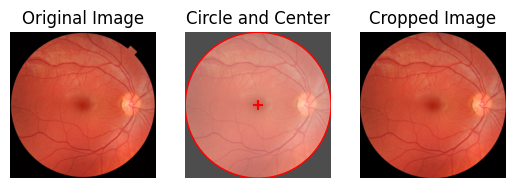

## Circle cropping for fundus images

A simple tool to fastly crop fundus images to a circle and center it.
It uses cv2 and numpy to process single images.



[ ] Works on tensor images <br>
[ ] Has batch support
### How to
See the [usage.ipynb](../0_example_usage/usage_circle-crop.ipynb).

### Ref
This is a wrapper for a part of the EyeQ preprocessing from <i>Huazhu Fu et al., "Evaluation of Retinal Image Quality Assessment Networks in Different Color-spaces" (2020)</i>. The original code is available [here](https://github.com/HzFu/EyeQ/blob/master/EyeQ_preprocess/fundus_prep.py).

### Cite
```bibtex
@inbook{Fu_2019,
   title={Evaluation of Retinal Image Quality Assessment Networks in Different Color-Spaces},
   ISBN={9783030322397},
   ISSN={1611-3349},
   url={http://dx.doi.org/10.1007/978-3-030-32239-7_6},
   DOI={10.1007/978-3-030-32239-7_6},
   booktitle={Medical Image Computing and Computer Assisted Intervention – MICCAI 2019},
   publisher={Springer International Publishing},
   author={Fu, Huazhu and Wang, Boyang and Shen, Jianbing and Cui, Shanshan and Xu, Yanwu and Liu, Jiang and Shao, Ling},
   year={2019},
   pages={48–56} }
```
