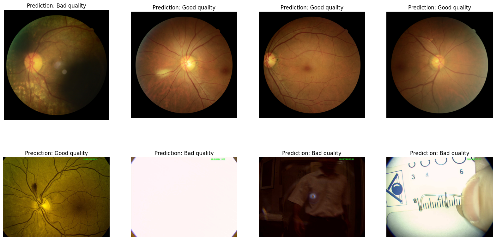

## A quality prediction model for fundus images (gradeable vs. ungradeable)
Based on a 10-model ensemble (ResNets and EfficientNets) trained on DeepDRiD and DrimDB data. For DrimDB images, we considered out-of-domain images such as photographs of the outer eye as ungradeable.



<br>
[x] Works on tensor images <br>
[x] Has batch support

### Preparation
- If you want to use the model, no preparation is needed an you can skip this part. Weights will be aquired automatically from zenodo.
- If you want to train or evaluate a model, you have to download these two datasets, store them somewhere and note down the paths.
    - [DeepDRiD dataset](https://doi.org/10.1016/j.patter.2022.100512) from [zenodo](https://zenodo.org/records/8248825)
    - [DrimDB dataset](https://doi.org/10.1117/1.jbo.19.4.046006) from [kaggle](https://www.kaggle.com/datasets/subhajournal/drimdb-diabetic-retinopathy-images-database?resource=download), see [here](https://academictorrents.com/details/99811ba62918f8e73791d21be29dcc372d660305) for a description

### How to
- Refer to [usage_quality.ipynb](../0_example_usage/usage_quality.ipynb) to use the model ensemble to predict the quality of an image.
- Refer to [training_quality_single-model.ipynb](../0_example_usage/training and evaluation/training_quality_single-model.ipynb) to train a model on the above datasets from a notebook.
- Refer to [training_quality_cli.py](../0_example_usage/training and evaluation/training_quality_cli.py) to train and/or evaluate a single model on the above datasets from the command line.
    You can pass a config file
    ```bash
    python train_cli.py --config /path/to/config.yaml
    ```
    Or, instead, set the respective config entries via command line arguments, see the help:
    ```bash
    python train_cli.py --help
    ```
- Refer to [training_quality_eval_ensemble.ipynb](../0_example_usage/training and evaluation/training_quality_eval_ensemble.ipynb) to evaluate the pre-trained model ensemble on the above datasets.

### Performance
- The model ensemble achieves an accuracy and ROCAUC of 0.78 and 0.84 on a DeepDRiD test split and 1.0 and 1.0 on a DrimDB test split.
- To predict DeepDRiD's binary quality annotation is known to be a difficult task. Hence, the previous sota is 0.75 and 0.75 for accuracy and ROCAUC, respectively, on a DeepDRiD test split ([Tummala et al., 2023](https://doi.org/10.3390/diagnostics13040622)).

### Cite