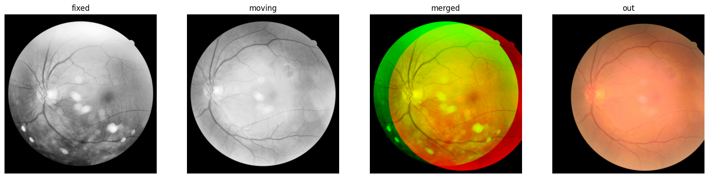
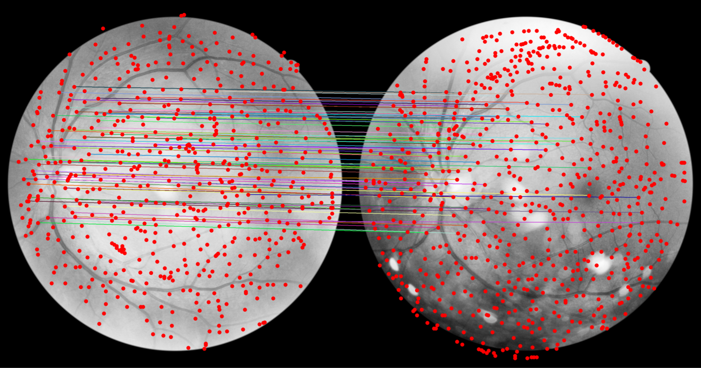

## Fundus image registration

Match/Align a fundus photograph to another fundus photograph from the same eye.

See the [usage_registration.ipynb](../0_example_usage/usage_registration.ipynb).

[x] Works on tensor images <br>
[ ] Has batch support

### Example: Alignment of the <i>moving</i> image to the <i>fixed</i> image



### Ref
This is a wrapper for SuperRetina from [<i>Jiazhen Liu et al., "Semi-Supervised Keypoint Detector and Descriptor for Retinal Image Matching" (2022)</i>](https://arxiv.org/abs/2207.07932). This package <!--clones the [official repository](https://github.com/ruc-aimc-lab/SuperRetina) and--> provides an interface to the registration task. Weights will be aquired automatically from [zenodo](https://zenodo.org/records/11241985/files/SuperRetina.pth). The input image contrasts are enhanced before being fed into the SuperRetina model at a size of 512x512 pixels.

### Cite
```bibtex
@InProceedings{superretina_liu_2022,
    author="Liu, Jiazhen
    and Li, Xirong
    and Wei, Qijie
    and Xu, Jie
    and Ding, Dayong",
    title="Semi-supervised Keypoint Detector and Descriptor for Retinal Image Matching",
    booktitle="Computer Vision -- ECCV 2022",
    year="2022",
    publisher="Springer Nature Switzerland",
    pages="593--609",
    isbn="978-3-031-19803-8"
}
```