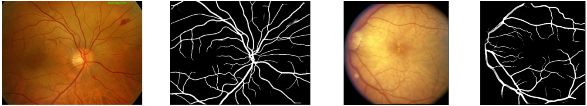

# Vessel segmentation for fundus images

Segment the blood vessels in a fundus image using an ensemble of FR-U-Nets trained on the FIVES dataset.

See the [usage_vessel-segmentation.ipynb](../0_example_usage/usage_vessel-segmentation.ipynb).



[ x ] Works on tensor images <br>
[(x)] Has batch support: Yes, you can pass batches, but internally, certain image preprocessing steps are performed sequentially.

### Ref
This is a wrapper for code from [<i>Köhler et al., "Efficiently correcting patch-based segmentation errors to control image-level performance in retinal images" (2024)</i>](https://openreview.net/forum?id=DDHRGHfwji&noteId=DDHRGHfwji). This package clones the [official repository](https://github.com/berenslab/MIDL24-segmentation_quality_control) and provides an interface to the segmentation task.

### Cite
```bibtex
@inproceedings{koehler_2024_efficiently,
    title={Efficiently correcting patch-based segmentation errors to control image-level performance},
    author={Patrick K{\"o}hler and Jeremiah Fadugba and Philipp Berens and Lisa M. Koch},
    booktitle={Submitted to Medical Imaging with Deep Learning},
    year={2024},
    url={https://openreview.net/forum?id=DDHRGHfwji}
}
```