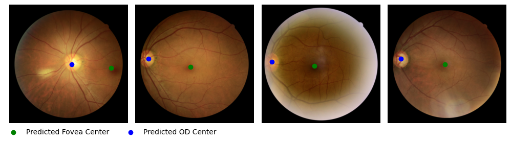
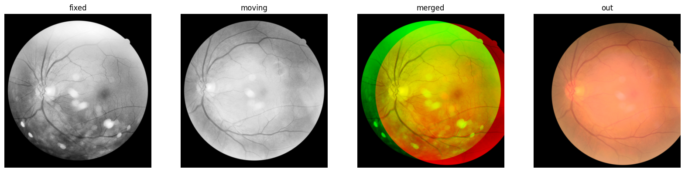
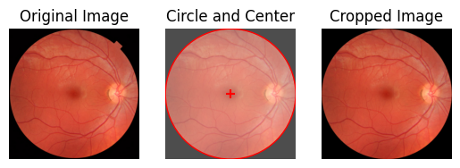

## Fundus Image Toolbox


<!-- <p style="font-size:3em;">Fundus Image Toolbox</p> -->

<details>
<summary><b>Fundus quality prediction</b></summary>
A quality prediction model for fundus images (gradeable vs. ungradeable) based on an ensemble of 10 models (ResNets and EfficientNets) trained on DeepDRiD and DrimDB data. Can be just used for prediction or retrained. 
<br><a href="./1_read_more/Readmore_quality_prediction.md">Read more</a>. <br>


</details>

<details>
<summary><b>Fundus fovea and optic disc localization</b></summary>
A model to predict the center coordinates of the fovea and the optic disc in fundus images based on a multi-task EfficientNet trained on ADAM, REFUGE and IDRID datasets. Can be just used for prediction or retrained. <br><a href="./1_read_more/Readmore_fovea_od_localization.md">Read more</a>. <br>


<br>Example predictions from the external dataset "DeepDRiD".
</details>

<details>
<summary><b>Fundus registration</b></summary>
Align a fundus photograph to another fundus photograph from the same eye using SuperRetina (<a href="https://arxiv.org/abs/2207.07932">Liu et al., 2022</a>). Image registration also goes by the terms image alignment and image matching. <br><a href="./1_read_more/Readmore_registration.md">Read more</a>. <br>


</details>

<details>
<summary><b>Fundus vessel segmentation</b></summary>
Segment the blood vessels in a fundus image using an ensemble of FR-U-Nets trained on the FIVES dataset (<a href="https://openreview.net/forum?id=DDHRGHfwji">Köhler et al., 2024</a>). <br><a href="./1_read_more/Readmore_vessel_segmentation.md">Read more</a>. <br>


</details>

<details>
<summary><b>Fundus circle crop</b></summary>
Fastly crop fundus images to a circle and center it (<a href="http://dx.doi.org/10.1007/978-3-030-32239-7_6">Fu et al., 2019</a>).
<br><a href="./1_read_more/Readmore_circle_crop.md">Read more</a>. <br>


</details>

<details>
<summary><b>Fundus utilities</b></summary>
A collection of additional utilities that can come in handy when working with fundus images.<br><a href="./1_read_more/Readmore_utilities.md">Read more</a>. <br>

- ImageTorchUtils: Image manipulation based on Pytorch tensors.
- Balancing: A script to balance a torch dataset by both oversampling the minority class and undersampling the majority class from [imbalanced-dataset-sampler](https://github.com/ufoym/imbalanced-dataset-sampler/).
- Fundus transforms: A collection of torchvision data augmentation transforms to apply to fundus images adapted from [pytorch-classification](https://github.com/YijinHuang/pytorch-classification/blob/master/data/transforms.py).
- Get pixel mean std: A script to calculate the mean and standard deviation of the pixel values of a dataset by channel.
- Get efficientnet resnet: Getter for torchvision models with efficientnet and resnet architectures initialized with ImageNet weights.
- Lr scheduler: Get a pytorch learning rate scheduler (plus a warmup scheduler) for a given optimizer: OneCycleLR, CosineAnnealingLR, CosineAnnealingWarmRestarts.
- Multilevel 3-way split: Split a pandas dataframe into train, validation and test splits with the options to split by group (i.e. keep groups together) and stratify by label. Wrapper for [multi_level_split](https://github.com/lmkoch/multi-level-split/).
- Seed everything: Set seed for reproducibility in python, numpy and torch.
</details>

<!-- <br>
<p style="font-size:1.5em;"><b>Usage</b></p> -->
### Usage

The following code summarises the usage of the toolbox. See the [usage.ipynb](usage.ipynb) for a tutorial notebook and [examples directory](./0_example_usage/) for more detailed usage examples information on the respective packages.
```python
# Get sample images. All methods work on path(s) to image(s) or on image(s) as numpy arrays, tensors or PIL images.
fundus1, fundus2 = "path/to/fundus1.jpg", "path/to/fundus2.jpg"
```

```python
import fundus_image_toolbox as fit
from fit.circle_crop import crop
fundus1_cropped = crop(fundus1, size=(512,512)) # > np.ndarray (512, 512, 3) uint8
```

```python
import fundus_image_toolbox as fit
from fit.fovea_od_localization import load_fovea_od_model, plot_coordinates
model, _ = load_fovea_od_model(device="cuda:0")
coordinates = model.predict([fundus1, fundus2]) # > List[np.ndarray[fovea_x,fovea_y,od_x,od_y], ...]
plot_coordinates([fundus1, fundus2], coordinates)
```

```python
import fundus_image_toolbox as fit
from fit.quality_prediction import load_quality_ensemble, ensemble_predict_quality, plot_quality
ensemble = load_quality_ensemble(device="cuda:0")
confs, labels = ensemble_predict_quality(ensemble, [fundus1, fundus2], threshold=0.5) # > np.ndarray[conf1, conf2], np.ndarray[label1, label2]
for img, conf, label in zip([fundus1, fundus2], confs, labels):
    plot_quality(img, conf, label, threshold=0.5)
```

```python
import fundus_image_toolbox as fit
from fit.registration import load_registration_model, register, DEFAULT_CONFIG
model, matcher = load_registration_model(config)

moving_image_aligned = register(
    fundus1, 
    fundus2, 
    show=True, 
    show_mapping=False, 
    config=DEFAULT_CONFIG, 
    model=model, 
    matcher=matcher
) # > np.ndarray (h_in, w_in, 3) uint8
```

```python
import fundus_image_toolbox as fit
from fit.vessel_segmentation import load_segmentation_ensemble, ensemble_predict_segmentation, plot_masks
ensemble = load_segmentation_ensemble(device=device)
vessel_masks = ensemble_predict_segmentation(ensemble, [fundus1, fundus2], threshold=0.5, size=(512, 512)) # > np.ndarray[np.ndarray[h_in, w_in], ...] float64
plot_masks([fundus1, fundus2], vessel_masks)
```

<!-- <br>
<p style="font-size:1.5em;"><b>Installation</b></p> -->
### Installation

<small>Use Python version 3.9.5 as <i>vessel_segmentation</i> requires versions <3.10.</small><br> 

#### 1) Create a virtual environment <br>
```bash
conda create --name fundus_image_toolbox python=3.9.5 pip
conda activate fundus_image_toolbox
```

#### 2) Install the toolbox <br>
```bash
pip install git+https://github.com/berenslab/fundus_image_toolbox
```

<!-- -or- -->

<!-- #### 2b) Install parts of the toolbox
Replace `<subpackage>` in the following command with the subfolder name of the desired package (i.e., `fundus_quality_prediction`, `fundus_fovea_od_localization`, `fundus_registration`, `fundus_vessel_segmentation`, `fundus_circle_crop`, or `fundus_utilities`) and run:
```bash
pip install 'git+https://github.com/berenslab/fundus_image_toolbox#egg=<subpackage>&subdirectory=<subpackage>'
``` -->

### Contribute
You are very welcome to contribute to the toolbox. Please raise an issue or create a pull request to do so. Please feel free to contact us if you have any questions or need help via julius.gervelmeyer [at] uni-tuebingen.de.

<!-- <br>
<p style="font-size:1.5em;"><b>Cite</b></p> -->
### Cite

If you use this toolbox in your research, please consider citing it:
```bibtex
TODO: Have a doi to cite
```

If you use external parts of the toolbox that this toolbox provides an interface for, please consider citing the respective papers:
- Fundus registration: [Liu et al., 2022](https://arxiv.org/abs/2207.07932)
- Fundus vessel segmentation: [Köhler et al., 2024](https://openreview.net/forum?id=DDHRGHfwji)
- Fundus circle crop: [Fu et al., 2019](http://dx.doi.org/10.1007/978-3-030-32239-7_6)
    <!-- - [Müller et al., 2023](https://zenodo.org/records/10630386) -->
    <!-- -  -->

<!-- <br>
<p style="font-size:1.5em;"><b>License</b></p> -->
### License

The toolbox is licensed under the MIT License. See the [license file](./LICENSE) for more information. <!-- As external packages are used, please check the respective licenses. That includes [fundus_vessel_segmentation](fundus_vessel_segmentation).-->


