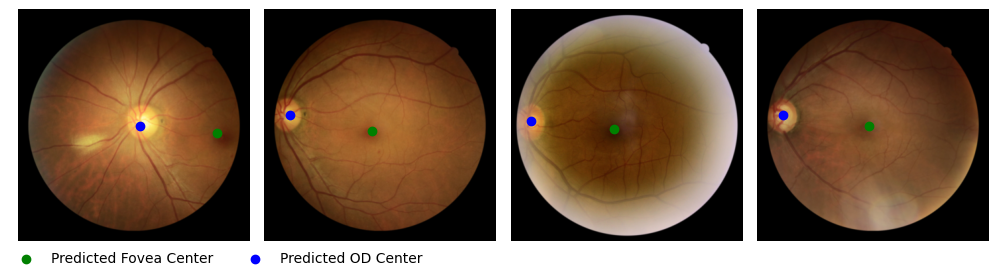

## A Fovea and optic disc localization model for fundus images
A model to predict the center coordinates of the fovea and the optic disc in fundus images based on a multi-task EfficientNet trained on ADAM, REFUGE and IDRID datasets.


<br>Example predictions from the external dataset "DeepDRiD".

<br>

[x] Works on tensor images <br>
[x] Has batch support

### Preparation
- If you want to use the model, no preparation is needed and you can skip this part. Weights will be aquired automatically from zenodo.
- If you want to train or evaluate a model, you have to download these three datasets and store the extracted datasets into a common parent folder s.t. it contains the subdirectories `ADAM`, `REFUGE` and `IDRID`.
    - [ADAM dataset](https://doi.org/10.48550/arXiv.2202.07983) from [baidu](https://ai.baidu.com/broad/download)
    - [REFUGE dataset](https://doi.org/10.48550/arXiv.1910.03667) from [baidu](https://ai.baidu.com/broad/download)
    - [IDRID dataset](https://doi.org/10.1016/j.media.2019.101561) from [ieee](https://ieee-dataport.org/open-access/indian-diabetic-retinopathy-image-dataset-idrid)

- As the ADAM and REFUGE datasets provide optic disc masks instead of center coordinates, we have to extract the center coordinates from the masks. This is done in the [misc_masks_to_coordinates_ADAM.ipynb](misc_masks_to_coordinates_ADAM.ipynb) and [misc_masks_to_coordinates_REFUGE.ipynb](misc_masks_to_coordinates_REFUGE.ipynb) scripts. Finally, combine all datasets using the [misc_combine_IDRID_ADAM_REFUGE.ipynb](misc_combine_IDRID_ADAM_REFUGE.ipynb) script.

### How to
- See [usage.ipynb](usage.ipynb) for prediction or training and evaluation from a notebook.
- See [train_cli.py](train_cli.py) for training from the command line:
    You can pass a config file
    ```bash
    python train_cli.py --config /path/to/config.yaml
    ```
    Or, instead, set the respective config entries via command line arguments, see the help:
    ```bash
    python train_cli.py --help
    ```

### Ref
This project uses substantial parts of a [tutorial](https://python.plainenglish.io/single-object-detection-with-pytorch-step-by-step-96430358ae9d) that has kindly given permission to use it. You can find the original code [here](https://github.com/dorzv/ComputerVision/blob/cc41b9d40af2b8b878f1352ec1308f031ad5b3f6/single_object_detection/Pytorch_Single_Object_Detection.ipynb).


### Cite