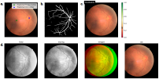

<!--  -->

# Summary
The Fundus Image Toolbox is a Python suite of tools for working with retinal fundus images. It includes quality prediction, localization for the fovea and optic disc centers, image registration, blood vessel segmentation, and fundus cropping functionalities. Additionally, it provides a collection of useful utilities for image manipulation and image based Pytorch models. The toolbox is designed to be flexible and easy to use. All tools can be installed as a whole or individually, depending on the user's needs. \autoref{fig:example} illustrates main functionalities. Find the toolbox here: [github.com/berenslab/fundus_image_toolbox](https://github.com/berenslab/fundus_image_toolbox)

# Statement of need
In ophthalmic research, retinal fundus images are often used as a resource for studying various eye diseases such as diabetic retinopathy, glaucoma and age-related macular degeneration. Consequently, there is a large amount of research on machine learning for fundus image analysis. However, many of the works do not publish their source code, and very few of them provide ready-to-use open source tools to the community.

The Fundus Image Toolbox has been developed to address this need within the medical image analysis community. It offers a comprehensive set of tools for automated processing of retinal fundus images, covering a wide range of tasks: Fastly cropping fundus images to a circle, aligning fundus images, segmenting blood vessels, predicting the image quality, and localizing the fovea and optic disc centers. The methods accept all standard image types and batches thereof and whenever possible, image batches are efficiently processed as such. This allows the tools to be seamlessly combined into a processing pipeline. The quality prediction and localization models have been developed by the authors and allow for both prediction and retraining of the models. The other main functionalities are based on state-of-the-art methods from the literature [@fu2019; @liu2022; @koehler2024]. By providing an interface for these tasks, the toolbox aims to facilitate the development of new algorithms and models in the field of fundus image analysis. AutoMorph is the closest related work [@zhou2022], which provides a distinct and smaller set of tools for fundus image processing.

{ width=100% }

# Acknowledgements
We thank Ziwei Huang for reviewing the package. This project was supported by the Hertie Foundation. JG received funding through the Else Kröner Medical Scientist Kolleg "ClinbrAIn: Artificial Intelligence for Clinical Brain Research”. The authors thank the International Max Planck Research School for Intelligent Systems (IMPRS-IS) for supporting SM.

# References
