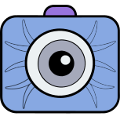

<!--  -->

# Summary
The Fundus Image Toolbox is an open source Python suite of tools for working with retinal fundus images. It includes quality prediction, fovea and optic disc center localization, blood vessel segmentation, image registration, and fundus cropping functions. It also provides a collection of useful utilities for image manipulation and image-based PyTorch models. The toolbox has been designed to be flexible and easy to use, thus helping to speed up research pipelines. All tools can be installed as a whole or individually, depending on the user's needs. \autoref{fig:example} illustrates main functionalities. 
Find the toolbox at [https://github.com/berenslab/fundus_image_toolbox](https://github.com/berenslab/fundus_image_toolbox).

# Statement of need
In ophthalmic research, retinal fundus images are often used as a resource for studying various eye diseases such as diabetic retinopathy, glaucoma and age-related macular degeneration. Consequently, there is a large amount of research on machine learning for fundus image analysis. However, many of the works do not publish their source code, and very few of them provide ready-to-use open source tools to the community.

The Fundus Image Toolbox has been developed to address this need within the medical image analysis community. It offers a comprehensive set of tools for automated processing of retinal fundus images, covering a wide range of tasks (see Tools). The methods all accept paths to images, standard image types and batches thereof and where possible, image batches are efficiently processed as such. This allows the tools to be seamlessly combined into a processing pipeline. The quality prediction and localization models have been developed by the authors and allow for both prediction and retraining of the models while the other main functionalities are based on state-of-the-art methods from the literature and offer prediction methods. By providing an interface for these tasks, the toolbox aims to facilitate the development of new algorithms and models in the field of fundus image analysis. AutoMorph is the closest related work [@zhou2022], which provides a distinct and smaller set of tools for fundus image processing.

# Tools
The main functionalities of the Fundus Image Toolbox are:

- Quality prediction (\autoref{fig:example}a.). We trained an ensemble of ResNets and EfficientNets on the combined DeepDRiD and DrimDB datasets [@deepdrid;@drimdb] to predict the gradeability of fundus images. Both datasets are publicly available. The model ensemble achieved an accuracy of 0.78 and an area under the receiver operating characteristic curve of 0.84 on a DeepDRiD test split and 1.0 and 1.0 on a DrimDB test split.
- Fovea and optic disc localization (\autoref{fig:example}b.). Prediction of fovea and optic disc center coordinates using a multi-task EfficientNet model. We trained the model on the combined ADAM, REFUGE and IDRID datasets [@adam;@refuge;@idrid], which are publicly available. On our test split, the model achieved a mean distance to the fovea and optic disc targets of 0.88 % of the image size. This corresponds to a mean distance of 3,08 pixels in the 350 x 350 pixel images used for training and testing.
- Vessel segmentation (\autoref{fig:example}c.). Segmentation of blood vessels in a fundus image using an ensemble of FR-U-Nets. The ensemble achieved an average Dice score of 0.887 on the test split of the FIVES dataset [@koehler2024].
- Registration (\autoref{fig:example}d.). Alignment of a fundus photograph to another fundus photograph of the same eye using SuperRetina: A keypoint-based deep learning model that produced registrations of at least acceptable quality in 98.5 % of the cases on the test split of the FIRE dataset [@liu2022].
- Circle crop. Fastly center fundus images and crop to a circle [@fu2019].

{ width=100% }

# Acknowledgements
We thank Ziwei Huang for reviewing the package. This project was supported by the Hertie Foundation. JG received funding through the Else Kröner Medical Scientist Kolleg "ClinbrAIn: Artificial Intelligence for Clinical Brain Research”. The authors thank the International Max Planck Research School for Intelligent Systems (IMPRS-IS) for supporting SM.

# References
